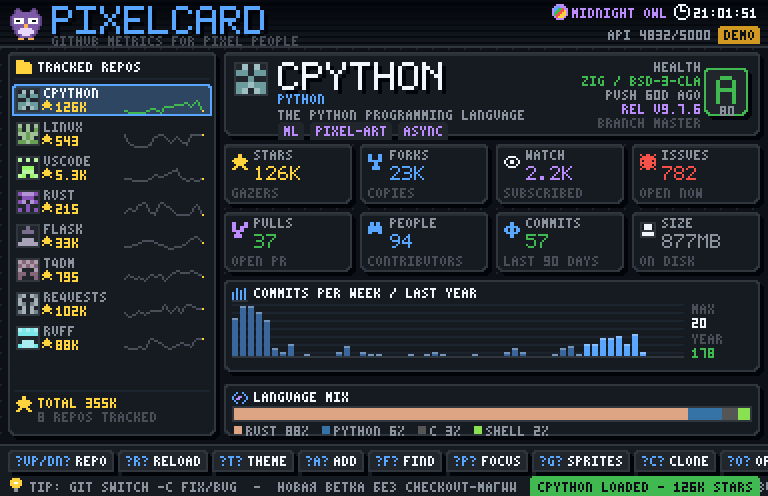
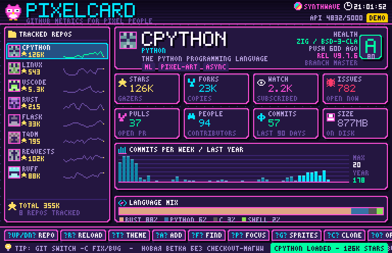

# PixelCard 🦉

Пиксельный дашборд метрик GitHub на Python + tkinter. Никаких картинок, шрифтов
и сторонних библиотек: **каждый пиксель рисуется кодом** — шрифты, иконки, совы,
графики, кнопки. Всё это заливается в один `tk.PhotoImage` и масштабируется (2x–6x).



## Запуск

```bash
python3 -m pixelcard                     # дефолтный список репозиториев
python3 -m pixelcard psf/requests astral-sh/ruff --scale 4
python3 -m pixelcard --offline           # demo-данные, полностью без сети
python3 -m pixelcard --theme SYNTHWAVE --debug
```

Требования: Python 3.9+ и tkinter (в Debian/Ubuntu: `sudo apt install python3-tk`,
в macOS/Windows идёт в комплекте). Внешних зависимостей нет.

Лимит GitHub API без токена — 60 запросов в час. С токеном 5000:

```bash
export GITHUB_TOKEN=ghp_xxx      # токену достаточно прав public_repo / вообще без scope
python3 -m pixelcard
```

Если сети нет, запрос упал или лимит исчерпан — карточка автоматически заполняется
стабильными demo-данными, приложение не падает. Ответы кэшируются в `~/.pixelcard/cache`,
список репозиториев, тема и статистика фокуса — в `~/.pixelcard/config.json`.

## Что показывает

| Блок | Данные |
| --- | --- |
| Тайлы метрик | звёзды, форки, watchers, открытые issues (без PR), открытые PR, контрибьюторы, коммиты за 90 дней, размер репо |
| HEALTH | своя эвристика 0–100 и оценка S…E: свежесть пуша, активность, отношение issues/stars, лицензия, релизы, число контрибьюторов |
| График | коммиты по неделям за год (`/stats/participation`), последние 8 недель подсвечены |
| Языки | стек-полоса с настоящими цветами языков GitHub + легенда |
| Сайдбар | все отслеживаемые репо, идентикон из хэша имени, звёзды, мини-спарклайн активности, суммарные звёзды |
| Шапка | тема, часы, остаток API-лимита, режим LIVE/DEMO, анимированная сова |

Полезные штуки поверх метрик:

* **Focus-режим (`P`)** — помодоро 25/5 с крупными пиксельными цифрами, счётчиком
  сессий и накопленными минутами (сохраняются в конфиг).
* **`C`** — `git clone https://github.com/<repo>.git` сразу в буфер обмена.
* **`O`** — открыть репозиторий в браузере.
* **`F`** — поиск репозиториев прямо в приложении (GitHub Search API) и добавление из результатов.
* **Тикер советов** — 30 практических подсказок по git/python/процессу внизу экрана.
* **`G`** — атлас всех спрайтов и палитра активной темы.

## Горячие клавиши

| Клавиши | Действие |
| --- | --- |
| `↑`/`↓` или `W`/`S`, `1`–`9`, мышь | выбор репозитория |
| `Enter` / `R` | обновить активный, `Shift+R` — все |
| `A` / `F` / `Delete` | добавить / найти / удалить репо |
| `T` / `Shift+T` | следующая / предыдущая тема (8 штук) |
| `P` | focus-режим; в нём `Space` старт-пауза, `N` фаза, `X` сброс |
| `G` / `H` / `Esc` | атлас спрайтов / справка / назад |
| `C` / `O` / `D` | clone в буфер / открыть в браузере / DEMO⇄LIVE |
| `+` / `-` | масштаб пикселя 2x–6x |
| `Q` | выход (с сохранением конфига) |

## Темы

MIDNIGHT OWL, GAMEBOY DMG, SYNTHWAVE, FOREST TERMINAL, PAPER ZINE, C64 BLUE,
SOLAR FLARE, ICE CAVE — переключаются на `T`, все спрайты перекрашиваются под палитру.



## Структура

```
pixelcard/
  fb.py         фреймбуфер: пиксели, панели со скруглением, линии, текст, PNG-экспорт
  pixelfont.py  три растровых шрифта: 5x7 (97 глифов), 3x5, 7x9 крупный
  sprites.py    68 спрайтов: 7 сов (idle/blink/wink/happy/wings/sleep/big) + иконки
  themes.py     8 палитр по 21 роли
  widgets.py    тайлы, бар-чарт, спарклайн, стек языков, идентикон, кнопки, бейджи
  screens.py    экраны: dashboard, focus, gallery, help, input
  state.py      состояние + конфиг ~/.pixelcard/config.json
  ghclient.py   GitHub API на urllib, кэш, парсинг Link-заголовков, demo-данные
  app.py        tkinter-обвязка: цикл кадров, клавиши, фоновые запросы в потоках
tools/preview.py  рендер всех экранов в PNG без окна (для тестов и скриншотов)
tests/            53 теста: рендер, шрифты, спрайты, метрики, конфиг, клавиши, помодоро
```

## Тесты и превью

```bash
python3 -m unittest discover -s tests -v        # 53 теста, ~1 c
python3 tools/preview.py screenshots            # перерисовать все PNG
```

Тесты не требуют дисплея: экраны рендерятся в фреймбуфер и сохраняются в PNG, а
tkinter в тестах логики подменяется заглушкой (проверяются `PhotoImage.put`,
клавиши, помодоро, фолбэк на demo-данные).

## Добавить свой спрайт или тему

```python
# pixelcard/sprites.py
MY_ICON = _s(
    "..AA..",
    ".AAAA.",
    "AA..AA",
    "AAAAAA",
)                      # символы -> роли палитры: A=accent, F=fg, S=star, K=border...
SPRITES["my_icon"] = MY_ICON
```

```python
# pixelcard/themes.py — скопируй любую Theme(...) и поменяй цвета,
# набор ключей должен совпадать (за этим следит тест).
```

## Ограничения

* Приложению нужен графический дисплей — без `$DISPLAY` оно честно сообщит об этом и выйдет.
* `/stats/participation` GitHub считает асинхронно: первый запрос может вернуть 202,
  тогда график появится после `R` через несколько секунд.
* Кадр рисуется на чистом Python (~20 мс на 384×248), поэтому FPS ограничен 15;
  при `--scale 6` на слабой машине уменьшай `--fps`.
